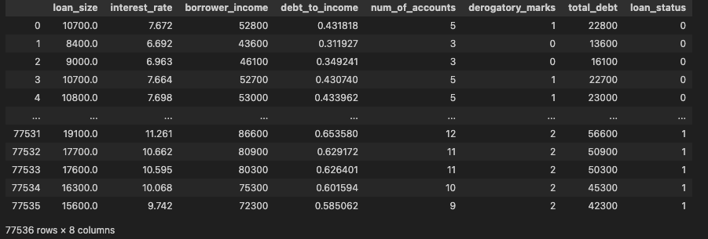
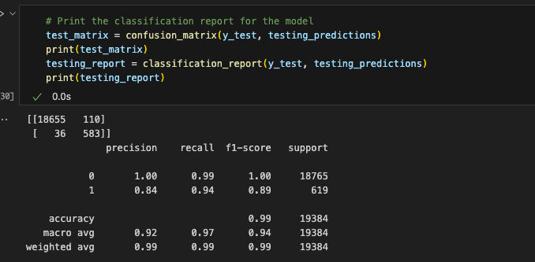

# Module 12 Report Template

## Overview of the Analysis

In this section, describe the analysis you completed for the machine learning models used in this Challenge. This might include:

The purpose of the analysis is to evaluate based on lending data to identify healthy loan and high-risk load. 

I read the csv file first, the healthy loan seems have lower interest rate, lower loan size, lower debt to income and number of accounts compare to un-healthy loan. 

then, I use the machine learning model to create Logistic Regression Model to generate classification report. 

## Results

Using bulleted lists, describe the accuracy scores and the precision and recall scores of all machine learning models.

The classification report shows 0.99 recall score for healthy loan, this is the number I believe that matters to the bank, so bank is not at risk to identify high-risk financial status borrower as healty. The F1 score is 1, which is perfect precision and recall performance. so the model can identify false positive and false negative data. 

The preision and recall score for high-risk loans is low.  0.84 score on precision means some healthy loans are identify as risky. So I read this into two parts: 1st, bank will lose some good customers since they are not going to get loans from this bank. 2nd: the bank might have un-accurate data. for example, borrower income might be incorrect. So the data collection process need to get improved. 

## Summary

Summarize the results of the machine learning models, and include a recommendation on the model to use, if any. For example:

I would reccomend the model to identify healty loans and require further process or aduit for high-risk loans. 
